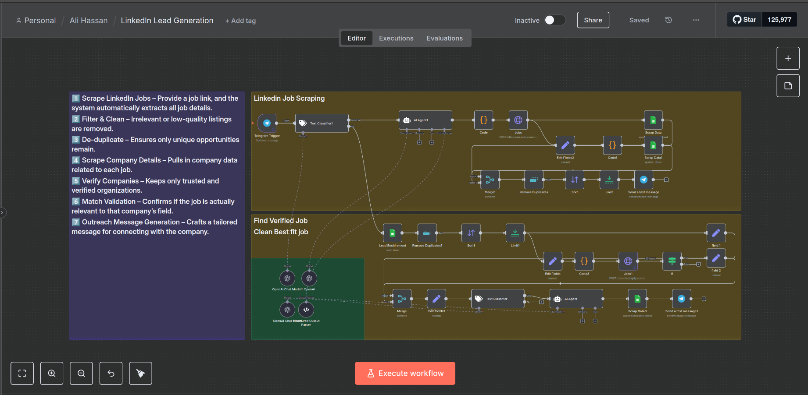

# Automating Job & Company Research with n8n

## 📌 Overview
This project automates the **entire workflow** of scraping, cleaning, validating, and generating outreach messages for LinkedIn jobs — all powered by **[n8n](https://n8n.io/)**.

Instead of manually searching, verifying, and crafting messages, this automation turns hours of research into **a few clicks**.

---


## 🚀 Features

1. **Scrape LinkedIn Jobs**
   - Input a LinkedIn job URL.
   - Automatically extract all job details (title, company, location, description, etc.).

2. **Filter & Clean Data**
   - Remove irrelevant or low-quality listings.
   - Standardize data format.

3. **De-duplicate Jobs**
   - Avoid processing the same job multiple times.

4. **Scrape Company Details**
   - Automatically fetch details about companies posting the jobs.

5. **Verify Companies**
   - Keep only **trusted and verified** companies.

6. **Match Job to Company**
   - Validate whether the job actually relates to the company’s domain.

7. **Generate Outreach Messages**
   - Create a **personalized outreach message** for each verified company.

---

## 🛠️ Tech Stack

- **[n8n](https://n8n.io/)** – Workflow automation platform.
- **Node.js** – Runtime environment for custom functions.
- **Cheerio / Puppeteer** – For web scraping.
- **JavaScript** – For data cleaning and transformation.
- **API Integrations** – For verification & enrichment.

---

## 📂 Project Structure

```plaintext
.
├── workflows/            # n8n workflows in JSON format
├── functions/            # Custom JS functions for processing
├── README.md              # Project documentation
└── assets/               # Screenshots & examples
````

---

## ⚡ Getting Started

### 1️⃣ Prerequisites

* [n8n](https://docs.n8n.io/getting-started/installation/) installed locally or on cloud.
* Node.js (if running custom functions).
* LinkedIn job URL(s) for testing.

### 2️⃣ Clone Repository

```bash
git clone https://github.com/alihassanml/Automating-Job-Company-Research-with-N8N.git
cd Automating-Job-Company-Research-with-N8N
```

### 3️⃣ Import Workflow to n8n

* Open n8n.
* Import the JSON file from `workflows/`.
* Set environment variables for APIs (if needed).

### 4️⃣ Run Automation

* Provide a LinkedIn job link.
* Watch as the workflow:

  1. Scrapes jobs
  2. Filters & de-duplicates
  3. Scrapes company details
  4. Verifies company authenticity
  5. Generates a tailored outreach message

---

## 📊 Example Output

**Input:**

```
LinkedIn Job URL: https://www.linkedin.com/jobs/view/123456/
```

**Output:**

```json
{
  "jobTitle": "Data Scientist",
  "company": "Tech Innovations Inc.",
  "location": "Remote",
  "verified": true,
  "outreachMessage": "Hi [Name], I came across your posting for a Data Scientist role..."
}
```

---

## 🎯 Use Cases

* **Recruiters** – Quickly vet companies & jobs.
* **Sales Teams** – Target verified leads.
* **Freelancers** – Automate job prospecting.

---

## 📬 Contact

If you want the **outreach message templates** or have any questions,
feel free to DM me on [LinkedIn](https://linkedin.com/in/alihassanml).
    # N8N-Automating-Job-Company-Research
# N8N-Automating-Job-Company-Research
